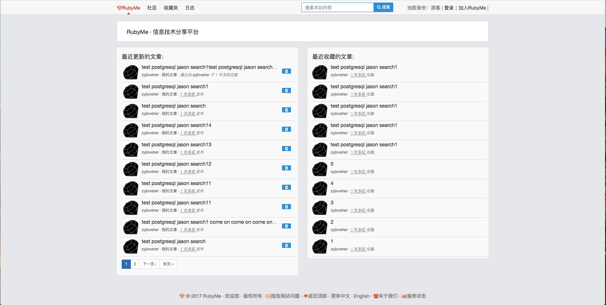

RubyMe: A Ruby on Rails platform for sharing blogs
=======

[](https://codeclimate.com/github/jasonZYJ/RubyMe)

RubyMe, a platform for sharing blog.



## Requirements

* Redis 2.2 +
* PostgreSQL 9.0 +
* Ruby 2.0.0 +
* Rails 4.0.0 +
* ImageMagick 6.5 +

## How to Install

Make sure postgresql already started.
```bash
git clone git@github.com:jasonZYJ/RubyMe.git

cd RubyMe && ruby setup.rb  # make project RTF
```
# Then change config at database.yml and settings.yml
```bash
RAILS_ENV=development rails s

bundle exec sidekiq -e development # for async sending email and uploading
```

## Deploy

```bash
cap production deploy
```

## Gemfile

By default bundler installs gems using the ruby.taobao.org source,
if you'd rather use the official one, set environment variable `USE_OFFICIAL_GEM_SOURCE`:

```bash
USE_OFFICIAL_GEM_SOURCE=1
```

## Test

We use rspec and capybara to test.
```bash
RAILS_ENV=test rake db:setup

RAILS_ENV=test rails s
```

Make sure already installed firefox.
```bash
bundle exec rspec -fd

bundle exec rspec -fd ./spec/features # Run only features test
```
